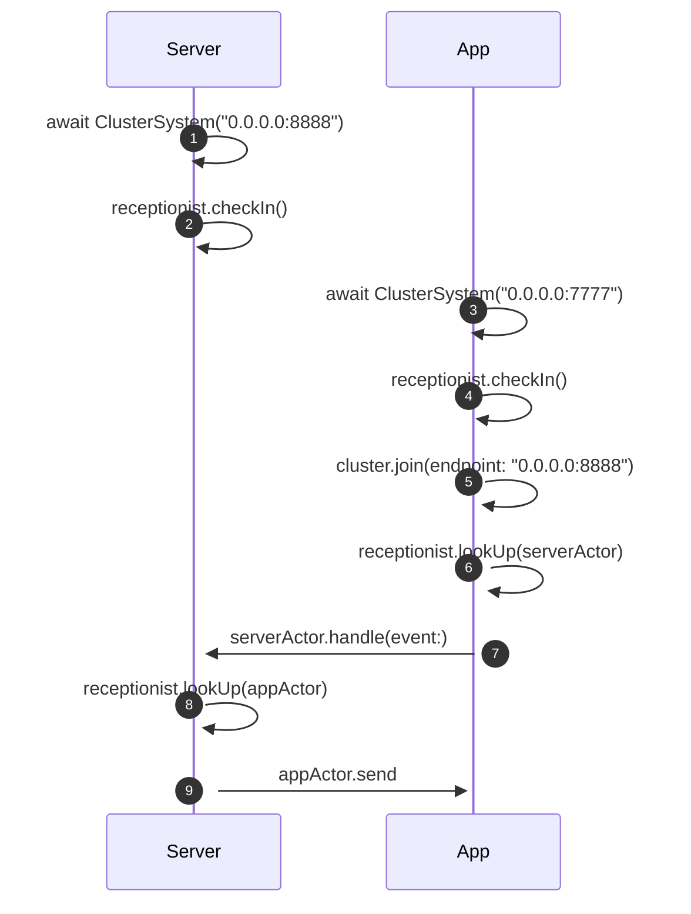

# DistributedHomeAutomation

This project serves as an example for [this blogpost](https://juliankahnert.de/posts/2025-02-09--swift-distributed-actors/).

The steps in this sequence diagramm can be found by looking for the `// MARK: - Step ` annotation in this project.

